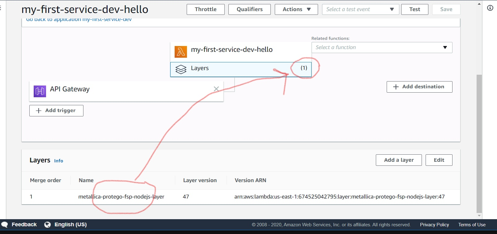

# AWS CodeStar Serverless web application with CheckPoint CloudGuard CICD Security
===================================================================================
a simple Node.js web service deployed by AWS CloudFormation to AWS Lambda and Amazon API Gateway and secured with CloudGuard Workload SAST and DAST security in an AWS CodePipeline.
CloudGuard Workload SAST is Proact with Source code scanning and Posture management 
CloudGuard Workload DAST is FSP for runtime security of the serverless function and can be applied selectively per function.

## What's Here
----------------


* README.md - this file
* buildspec.yml - this file is used by AWS CodeBuild to package your
  application for deployment to AWS Lambda
* index.js - this file contains the sample Node.js code for the web service
* template.yml - this file contains the AWS Serverless Application Model (AWS SAM) used
  by AWS CloudFormation to deploy your application to AWS Lambda and Amazon API
  Gateway.
* tests/ - this directory contains unit tests for your application
* template-configuration.json - this file contains the project ARN with placeholders used for tagging resources with the project ID

AWS CodeStar allows to create a project to deploy a serverless application using the AWS CodePipeline chosing an IDE and a runtime like node.js

PLease refer to the AWS CodePipeline log showing the CICD building and deploying the serverless application with an API-Gateway and a Lambda function with Proact scanning the serverless application code and the FSP applied to the API-GW and the Lambda

```

[Container] 2020/05/17 17:40:16 Running command export  AWS_REGION=us-east-1

[Container] 2020/05/17 17:40:16 Running command protego proact -m template.yml 
Container cmd: docker
Container options empty
Returning docker user: 0:0
No args required for docker
[cloudguard-cli: proact] Initializing... 
Updating Proact | [----------------------------------------] 0% | ETA: 0s
Updating Proact | [===========================-------------] 66% | ETA: 6s
Updating Proact | [========================================] 100% | ETA: 1s
Updating Proact | [========================================] 100% | ETA: 0s

[cloudguard-cli: proact]  - Initializing docker (protego/protego-runtime:latest) - please wait, this action may take some time ... 
[cloudguard-cli: proact] Initializing, Done. 
[cloudguard-cli: proact]  | --- Scanning --- | please wait, this action may take some time ... 
Using Only Sam template: template.yml
Parsing Template ... -······················Parsing Template ... \······················Parsing Template ... |······················Parsing Template ... /······················Parsing Template ... -······················Parsing Template ... \······················

( 0 / 1 ) -···········( 0 / 1 ) \···········( 0 / 1 ) |···········( 0 / 1 ) /···········( 0 / 1 ) -···········( 0 / 1 ) \···········( 0 / 1 ) |···········( 0 / 1 ) /···········( 0 / 1 ) -···········( 0 / 1 ) \···········( 0 / 1 ) |···········( 0 / 1 ) /···········( 0 / 1 ) -···········( 0 / 1 ) \···········( 0 / 1 ) |···········( 0 / 1 ) /···········( 0 / 1 ) -···········( 0 / 1 ) \···········( 0 / 1 ) |···········( 0 / 1 ) /···········( 0 / 1 ) -···········( 0 / 1 ) \···········( 0 / 1 ) |···········( 0 / 1 ) /···········( 0 / 1 ) 

[32m✓·[0m) GetHelloWorld
-----------------------------------
    PermissiveRole : ·[33mWarning (Low)·[0m - Role Too Permissive
    VulnerableDependency : ·[33mWarning (High)·[0m - Found Vulnerable Dependencies
    CredentialsUsage : ·[32mSucceeded·[0m
    RuleViolation : ·[32mSucceeded·[0m
Detailed output: ·[36mprotego_output/GetHelloWorld.yaml·[0m
-----------------------------------

Number of failed functions: 0
Scan detailed output: ·[36mfile:////codebuild/output/src498193408/src/protego_output/ProtegoScanResults.yaml·[0m
Scan detailed report (HTML): ·[36mfile:////codebuild/output/src498193408/src/protego_output/ProtegoScanReport.html·[0m


[Container] 2020/05/17 17:41:16 Running command aws cloudformation package --template template.yml --s3-bucket $S3_BUCKET --output-template template-export.yml

Uploading to 59d633931378ede80de0c73b4732976b  262144 / 2711749.0  (9.67%)
Uploading to 59d633931378ede80de0c73b4732976b  524288 / 2711749.0  (19.33%)
Uploading to 59d633931378ede80de0c73b4732976b  786432 / 2711749.0  (29.00%)
Uploading to 59d633931378ede80de0c73b4732976b  1048576 / 2711749.0  (38.67%)
Uploading to 59d633931378ede80de0c73b4732976b  1310720 / 2711749.0  (48.33%)
Uploading to 59d633931378ede80de0c73b4732976b  1572864 / 2711749.0  (58.00%)
Uploading to 59d633931378ede80de0c73b4732976b  1835008 / 2711749.0  (67.67%)
Uploading to 59d633931378ede80de0c73b4732976b  2097152 / 2711749.0  (77.34%)
Uploading to 59d633931378ede80de0c73b4732976b  2359296 / 2711749.0  (87.00%)
Uploading to 59d633931378ede80de0c73b4732976b  2621440 / 2711749.0  (96.67%)
Uploading to 59d633931378ede80de0c73b4732976b  2711749 / 2711749.0  (100.00%)
Successfully packaged artifacts and wrote output template to file template-export.yml.
Execute the following command to deploy the packaged template
aws cloudformation deploy --template-file /codebuild/output/src498193408/src/template-export.yml --stack-name <YOUR STACK NAME>

[Container] 2020/05/17 17:41:17 Phase complete: BUILD State: SUCCEEDED
[Container] 2020/05/17 17:41:17 Phase context status code:  Message: 
[Container] 2020/05/17 17:41:17 Entering phase POST_BUILD
[Container] 2020/05/17 17:41:17 Running command sed -i.bak 's/\$PARTITION\$/'${PARTITION}'/g;s/\$AWS_REGION\$/'${AWS_REGION}'/g;s/\$ACCOUNT_ID\$/'${ACCOUNT_ID}'/g;s/\$PROJECT_ID\$/'${PROJECT_ID}'/g' template-configuration.json

[Container] 2020/05/17 17:41:17 Running command protego fsp -c arn:aws:cloudformation:us-east-1:392332258562:stack/my-first-service-dev/2060e8a0-9065-11ea-81f7-12c270bd7978 -R us-east-1
[cloudguard-cli: fsp] FSP:: loadDependencies 
[cloudguard-cli: fsp] Initializing... 
Updating FSP Plugin | [----------------------------------------] 0% | ETA: 0s
Updating FSP Plugin | [============================------------] 70% | ETA: 6s
Updating FSP Plugin | [========================================] 100% | ETA: 0s

[cloudguard-cli: fsp] Initializing, Done. 
[cloudguard-cli] Fetching functions list from CF stack arn:aws:cloudformation:us-east-1:392332258562:stack/my-first-service-dev/2060e8a0-9065-11ea-81f7-12c270bd7978
[cloudguard-cli] Protego FSP (v1.4.25) Instrumentation Succeeded ✓ 
[cloudguard-cli]   - function ARN  :  arn:aws:lambda:us-east-1:392332258562:function:my-first-service-dev-hello:$LATEST
[cloudguard-cli]   - runtime       :  nodejs10.x
[cloudguard-cli]   - layer         :  arn:aws:lambda:us-east-1:674525042795:layer:metallica-protego-fsp-nodejs-layer:47
[cloudguard-cli]   - environment   :  {"PROTEGO_FSP_CUSTOMER_ACCOUNT_ID":"392332258562:ce53f6d8773ba09596db7bb4484f63e4","NODE_OPTIONS":"--require @protego/protego-node-agent"}
[cloudguard-cli] Protego FSP (v1.4.25) Instrumentation Succeeded ✓ 
[cloudguard-cli]   - function ARN  :  arn:aws:lambda:us-east-1:392332258562:function:my-first-service-dev-custom-resource-apigw-cw-role:$LATEST
[cloudguard-cli]   - runtime       :  nodejs12.x
[cloudguard-cli]   - layer         :  arn:aws:lambda:us-east-1:674525042795:layer:metallica-protego-fsp-nodejs-layer:47
[cloudguard-cli]   - environment   :  {"PROTEGO_FSP_CUSTOMER_ACCOUNT_ID":"392332258562:eb0b32336f45de4ed8b11d7ab2d34308","NODE_OPTIONS":"--require @protego/protego-node-agent"}
[cloudguard-cli] 
Protego - FSP (1.4.25) Summary:

  Protected Functions (2) :
    ✓ arn:aws:lambda:us-east-1:392332258562:function:my-first-service-dev-hello:$LATEST:  Protected 
    ✓ arn:aws:lambda:us-east-1:392332258562:function:my-first-service-dev-custom-resource-apigw-cw-role:$LATEST:  Protected 
 
```

## Here we can see the CloudGuard FSP (Function Self Protection) for runtime security is applied:

  
  
